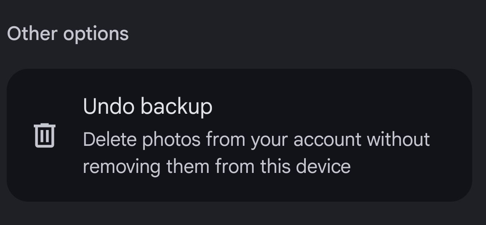
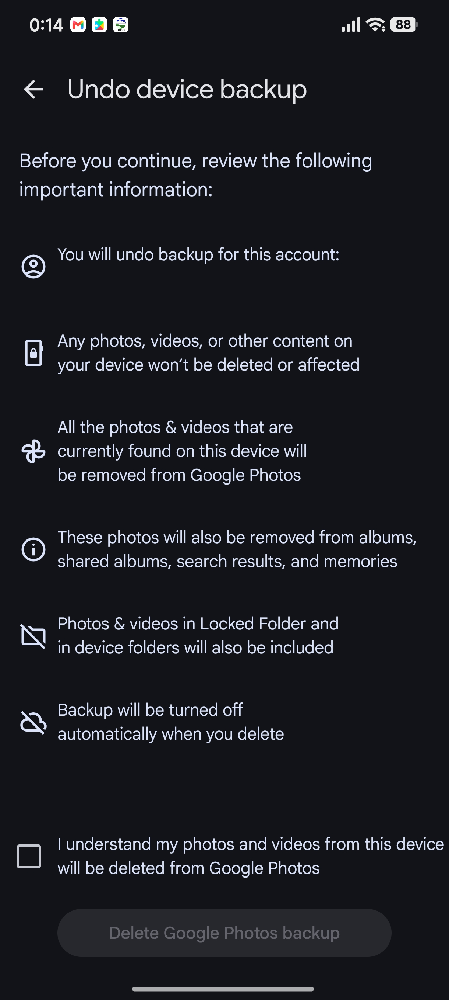

# Pemulihan Media Android dari Sampah Sistem (`.trashed-`) via ADB

Panduan dan skrip untuk kasus foto/video yang "hilang" dari galeri Android — padahal file aslinya masih utuh di penyimpanan, hanya namanya diubah sistem menjadi `.trashed-<kedaluarsa>-<namaasli>`.

Ditulis dari kasus nyata: **2.085 file (56,29 GB)** lenyap dari galeri bawaan setelah backup Google Photos di-*undo* karena kuota penyimpanan penuh. Semua file dikembalikan **tanpa langganan cloud, tanpa aplikasi recovery pihak ketiga, tanpa root** — cukup lewat adb.

Seluruh prosesnya dijalankan oleh **Hermes Agent** dengan model **`deepseek/deepseek-v4.1-flash`** (rincian di bagian 10).

---

## 1. Gejala

- Foto/video hilang dari galeri bawaan; entri yang masih tampil tidak bisa dibuka ("error", hanya thumbnail sisa).
- Terjadi setelah menekan **Undo backup** di Google Photos ketika kuota Google One habis/berhenti.
- Keterangan di layar justru menyatakan *"foto dan video di perangkat tidak akan terpengaruh"* — teks persisnya ada di bagian 2.
- File manager yang bisa menampilkan file tersembunyi **masih menemukan filenya**, dengan nama berawalan `.trashed-<angka>-`.
- Sisa ruang penyimpanan tidak bertambah walau media "hilang" — karena datanya masih ada, cuma disembunyikan.

## 2. Alur yang ditekan dan teks layar yang menyesatkan

Pemicunya adalah fitur **Undo backup** di Google Photos, letaknya di:

`Profil → Setelan Google Photos → Backup → Other options → Undo backup`

dengan keterangan pendek: *"Delete photos from your account without removing them from this device"*.



Menekan baris itu memunculkan layar konfirmasi **"Undo device backup"**. Isinya persis seperti ini:

> **Before you continue, review the following important information:**
>
> You will undo backup for this account:
> `<alamat email akun>` *(disensor pada tangkapan layar di bawah)*
>
> **Any photos, videos, or other content on your device won't be deleted or affected**
>
> All the photos & videos that are currently found on this device will be removed from Google Photos
>
> These photos will also be removed from albums, shared albums, search results, and memories
>
> Photos & videos in Locked Folder and in device folders will also be included
>
> Backup will be turned off automatically when you delete
>
> ☐ I understand my photos and videos from this device will be deleted from Google Photos
>
> `[ Delete Google Photos backup ]`



*(Alamat email pada tangkapan layar disensor.)*

Kalimat kuncinya: **"Any photos, videos, or other content on your device won't be deleted or affected"**. Kenyataannya, 2.085 file milik perangkat justru dipindahkan ke tempat sampah sistem (`.trashed-*`) dan hilang dari galeri.

Catatan soal wording-nya, supaya adil sekaligus jelas: secara teknis file **tidak "deleted"** — hanya dipindahkan ke sampah sistem (berganti nama, disembunyikan, `IS_TRASHED=1`) dan akan dimusnahkan otomatis setelah 30 hari. Jadi kalimat "won't be deleted" masih bisa dianggap benar dari sisi aplikasi, sementara bagi pengguna hasilnya identik dengan terhapus. Yang lebih sulit dibela adalah kata **"or affected"**: layar yang sama juga menyatakan *"Photos & videos in Locked Folder and in device folders will also be included"* — artinya `Undo backup` memang menyentuh folder perangkat, dan klaim "won't be affected" tidak mencerminkan apa yang benar-benar terjadi.

## 3. Apa yang sebenarnya terjadi

Android 11+ punya **tempat sampah tingkat sistem** di MediaStore. Ketika sebuah aplikasi memindahkan file media ke sampah, `MediaProvider` mengganti nama file *di tempat* menjadi:

```text
.trashed-<dateExpires>-<namaAsli>
```

- `<dateExpires>` = stempel waktu Unix (**detik**) kapan file akan dihapus permanen.
- Retensi bawaan **30 hari** (`DEFAULT_DURATION_TRASHED`); varian `.pending-` 7 hari.
- Karena namanya diawali titik dan statusnya `IS_TRASHED=1`, file **disembunyikan dari galeri dan dari MTP/Windows Explorer** — tetapi isinya utuh, bukan rusak.
- AOSP: `packages/providers/MediaProvider` → `util/FileUtils.java`, pola `PATTERN_EXPIRES_FILE = (?i)^\.(pending|trashed)-(\d+)-([^/]+)$`

Artinya: selama file masih berwujud di penyimpanan, pemulihannya **hanya soal mengembalikan nama** — tidak perlu cloud, tidak perlu root, tidak perlu alat recovery.

## 4. Kenapa restore dari Google Photos bukan jalan keluar

- Restore mengembalikan salinan **ke cloud**, jadi butuh kuota. Kalau langganan berhenti dan kuota penuh, restore gagal atau hanya bisa sebagian.
- Padahal file lokalnya masih ada — pemulihan lokal sama sekali tidak menyentuh kuota.
- Yang benar-benar butuh kuota hanya item sampah yang **tidak punya file lokal** (foto lama / yang dulu pernah dilepas dari perangkat).

## 5. Prasyarat

1. **platform-tools (adb)** di komputer — unduhan resmi Google:
   <https://dl.google.com/android/repository/platform-tools-latest-windows.zip>
2. **USB debugging** aktif di HP: `Setelan → Tentang ponsel → ketuk Versi MIUI/OS 7 kali → Opsi pengembang → Debug USB`.
   - Xiaomi/HyperOS kadang minta login Mi Account dan SIM terpasang.
3. Colok kabel, pilih mode **Transfer File**, lalu **izinkan dialog "Allow USB debugging"** di HP (centang "selalu izinkan").
4. Pastikan terdeteksi: `adb devices` harus menampilkan status `device`, **bukan** `unauthorized`.

## 6. Prosedur

```bash
ADB=./platform-tools/adb.exe          # linux/mac: ./platform-tools/adb

# 1. Inventaris dulu (read-only): hitung & ukur semua file bertanda sampah
"$ADB" push scripts/inventory.sh /data/local/tmp/inventory.sh
"$ADB" shell sh /data/local/tmp/inventory.sh > inv_raw.txt

# 2. Backup dulu sebelum mengubah apa pun (opsional tapi disarankan)
#    -> copy folder terkait ke komputer lewat file manager HP (tampilkan file tersembunyi)
#       atau lewat adb pull, lihat bagian "Jebakan" nomor 2.

# 3. Kembalikan nama file di tempat (file tidak dipindahkan antar folder)
"$ADB" push scripts/restore.sh /data/local/tmp/restore.sh
"$ADB" shell sh /data/local/tmp/restore.sh
"$ADB" pull /data/local/tmp/rename_log.txt ./rename_log.txt

# 4. Paksa sistem mengindeks ulang
"$ADB" shell content call --uri content://media/ --method scan_volume --arg external_primary
#    kalau galeri belum menampilkan semuanya: restart HP sekali

# 5. Uji isi file (bukan hanya namanya)
"$ADB" pull "/storage/emulated/0/DCIM/Camera/<salah-satu-file>.jpg" ./verify/
python scripts/verify.py ./verify
```

Skrip `restore.sh` menulis log lengkap `nama_lama|nama_baru` untuk setiap file, sehingga seluruh operasi bisa ditelusuri atau diulang.

## 7. Verifikasi — jangan hanya percaya "berhasil"

Empat hal yang wajib dicek:

1. **Ringkasan skrip**: `OK=<jumlah> SKIP=0 FAIL=0`.
2. **Sisa file sampah harus 0**:
   `adb shell "find /storage/emulated/0 -name '.trashed-*' -type f | wc -l"`
3. **Log konsisten**: jumlah baris log = jumlah file yang dipulihkan, tidak ada `EXISTS`/`FAIL`.
4. **Isi file benar-benar utuh**: tarik beberapa file acak (beda jenis: JPEG, HEIC, PNG, MP4, WebP), lalu cek header + ukurannya cocok dengan ukuran sebelum dipulihkan. Pakai `scripts/verify.py`.

Pada kasus yang jadi dasar dokumen ini: `OK=2085 SKIP=0 FAIL=0`, sisa sampah `0`, dan 5 sampel lintas jenis lulus uji header **dan** ukurannya identik.

## 8. Jebakan yang paling sering bikin gagal

1. **`find /sdcard` mengembalikan nol hasil.** `/sdcard` adalah symlink dan `toybox find` tidak menelusuri argumen awal yang berupa symlink. Selalu pakai path aslinya: `/storage/emulated/0`.
2. **Backup lewat Windows Explorer/MTP terlihat "sukses" padahal tidak lengkap.** MTP memakai MediaStore, dan item bertanda sampah disembunyikan. File terpenting justru yang tidak ikut tercopy. Pakai file manager HP dengan "tampilkan file tersembunyi" aktif, atau `adb pull`.
3. **Jangan mengandalkan keterangan UI.** Pada kasus ini UI menjanjikan file di perangkat tidak terpengaruh, sementara 2.085 file memang dipindahkan ke sampah sistem.
4. **Hitung batas waktunya.** Retensi 30 hari sejak dipindahkan. Pada kasus ini file yang paling cepat kedaluarsa jatuh tepat di hari pengerjaan — menunda beberapa hari berarti kehilangan permanen.
5. **`stat` dengan format berisi `|` lewat `adb shell` bisa pecah** (karakter itu dibaca sebagai pipe di sisi perangkat). Pakai `adb shell stat -c %s <file>` per file, lalu gabungkan di komputer.
6. **Jangan aktifkan lagi backup** di perangkat itu sebelum urusan kuota cloud beres, dan **jangan kosongkan sampah** (baik sampah sistem maupun Sampah Google Photos) selama pemulihan belum selesai.
7. **Jangan beli/instal aplikasi "photo recovery"** untuk kasus ini. Filenya tidak terhapus, hanya berganti nama — alat recovery tidak diperlukan, dan sebagian besar aplikasi semacam itu menyesatkan. Pemulihan file yang benar-benar terhapus dari penyimpanan internal Android modern praktis tidak mungkin tanpa root.
8. **`adb devices` menampilkan `unauthorized`?** Itu artinya HP belum memberi izin; tidak ada perintah yang bisa jalan sampai dialog "Allow USB debugging" di HP ditekan.

## 9. Hasil pada kasus ini

| Folder | Jumlah file dipulihkan |
|---|---|
| `DCIM/Camera` | 1.222 |
| `DCIM/Screenshots` | 696 |
| `DCIM/ScreenRecorder` | 55 |
| `DCIM/Facebook` | 49 |
| `DCIM/Camera/Raw` | 15 |
| `DCIM/RealSR` | 14 |
| `DCIM/Blackmagic Camera` | 11 |
| `DCIM/Creative` | 7 |
| `DCIM/VN` | 7 |
| `DCIM` | 4 |
| `DCIM/Google Photos` | 4 |
| `DCIM/Restored` | 1 |
| **Total** | **2.085 file / 56,29 GB** |

Jenis file: 1.241 `.jpg`, 646 `.mp4`, 120 `.heic`, 58 `.png`, 15 `.dng`, 4 `.gif`, 1 `.webp`.

## 10. Cara kasus ini dieksekusi

Seluruh pengerjaan pada kasus ini — dari penelusuran gejala sampai verifikasi akhir — dijalankan oleh **Hermes Agent** (agent desktop dari Nous Research) dengan model **`deepseek/deepseek-v4.1-flash`** lewat gateway `commandcode`, pada Windows 11.

Urutan yang dikerjakan agent:

1. Memasang `platform-tools` (adb) di komputer dan memeriksa `adb devices`.
2. Memandu aktivasi USB debugging dan otorisasi perangkat — bagian ini memang hanya bisa ditekan manusia di layar HP, dan agent berhenti menunggu sampai perangkat berstatus `device`.
3. Menjalankan inventaris: `find /storage/emulated/0 -name '.trashed-*' -type f` ditambah `stat -c '%s|%Y'` per file → terhitung 2.085 file / 56,29 GB, direkap per folder dan per jenis file.
4. Menjalankan pemulihan nama secara massal di dalam perangkat lewat skrip shell yang dikirim dengan `adb push` dan dijalankan dengan `adb shell sh`, sekaligus menulis log `nama_lama|nama_baru`, lalu menarik log itu kembali ke komputer dengan `adb pull`.
5. Memverifikasi hasil: sisa file bertanda sampah = 0, jumlah baris log = jumlah file, dan 5 sampel lintas jenis (JPEG, HEIC, PNG, MP4, WebP) ditarik ke komputer untuk diuji header dan dibandingkan ukurannya dengan inventaris.
6. Memaksa pengindeksan ulang media (`content call ... scan_volume`) dan menyusun dokumentasi ini.

Skrip di folder `scripts/` adalah versi bersih dari yang benar-benar dipakai; semua angka di dokumen ini berasal dari keluaran nyata, bukan perkiraan.

## 11. Referensi

- AOSP MediaProvider `util/FileUtils.java` — pola dan retensi nama file sampah.
  <https://android.googlesource.com/platform/packages/providers/MediaProvider/>
- Google Photos Help — *Delete photos & videos*, bagian "Remove all backed up photos & videos from Google Photos, but not from your device" (Undo backup).
  <https://support.google.com/photos/answer/6128858>
- Google Photos Help — *Restore recently deleted photos & videos* (sampah 60 hari untuk yang di-backup, 30 hari untuk yang tidak).
  <https://support.google.com/photos/answer/9343482>
- `MediaStore.createTrashRequest` / `restoreFileFromTrash` (Android 11+).
  <https://developer.android.com/reference/android/provider/MediaStore>

## Lisensi

MIT — silakan pakai dan sebarkan.
